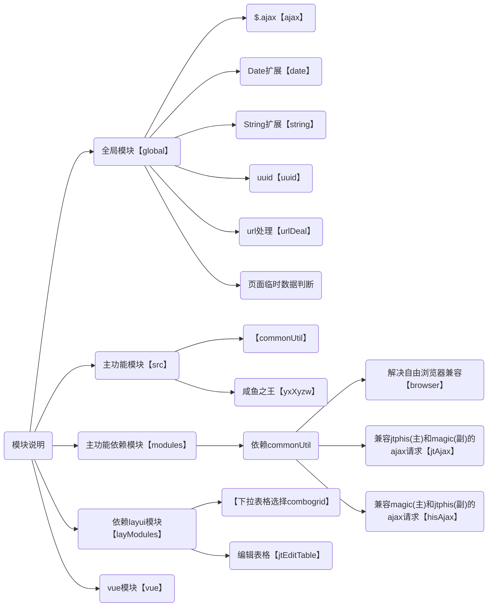

# 开发模块说明

```mermaid
graph LR

A("模块说明")-->AA("全局模块【global】")-->AAA("$.ajax【ajax】")
AA-->AAB("Date扩展【date】")
AA-->AAC("String扩展【string】")
AA-->AAD("uuid【uuid】")
AA-->AAE("url处理【urlDeal】")
AA-->AAF("页面临时数据判断")

A-->AB("主功能模块【src】")-->ABA("【commonUtil】")
AB-->ABB("咸鱼之王【yxXyzw】")

A-->AC("主功能依赖模块【modules】")-->ACA("依赖commonUtil")-->ACAA("解决自由浏览器兼容【browser】")
ACA-->ACAB("兼容jtphis(主)和magic(副)的ajax请求【jtAjax】")
ACA-->ACAC("兼容magic(主)和jtphis(副)的ajax请求【hisAjax】")

A-->AD("依赖layui模块【layModules】")-->ADA("【下拉表格选择combogrid】")
AD-->ADB("编辑表格【jtEditTable】")

A-->AE("vue模块【vue】")
```
