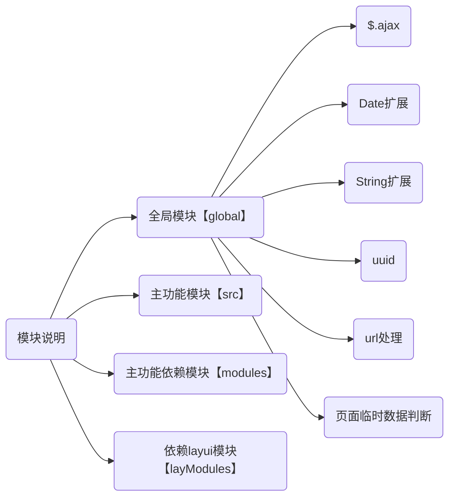

# 打包说明
1. 可通过修改global/ajax/var/ajax中的部分参数更改ajax配置信息，具体配置如下：

|参数名|说明|
|:-----  |-----                           |
|jqMode|设置不同的鉴权模式，现仅支持magic:header鉴权（该参数修改后，应在主程序同步提供鉴权方案）|
|contentType|设置ajax:post提交数据方式(该参数修改后须同步修改主程序中的dealAjaxData)|

# 开发模块说明
